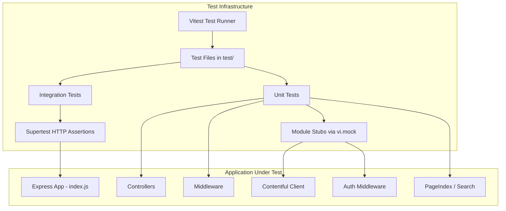

# Design Document: Vulnerability Remediation

## Overview

This design establishes an automated test suite for the existing Express.js application, then uses that safety net to upgrade vulnerable npm packages. The approach is:

1. **Add a test framework** (Vitest) configured for CommonJS on Node.js 23
2. **Write unit/integration tests** covering route handlers, middleware, content processing, search, and security configuration
3. **Upgrade vulnerable packages** with confidence that regressions are caught
4. **Integrate into CI** via GitHub Actions

The test suite acts as the regression safety net — if any package upgrade breaks functionality, a test will fail and block the merge.

## Architecture



### Design Decisions

| Decision | Choice | Rationale |
|----------|--------|-----------|
| Test framework | Vitest | Native CommonJS support, built-in mocking via `vi.mock()`, fast execution, no transpilation needed on Node.js 23 |
| HTTP testing | Supertest | Industry standard for Express testing, no port binding needed |
| Mocking strategy | `vi.mock()` module-level | Intercepts `require()` calls without modifying source, ideal for stubbing Contentful/Redis/Notify |
| Test structure | `test/` directory with mirror of app structure | Clear mapping between source and test files |
| Property testing | `fast-check` | Leading PBT library for JavaScript, integrates with Vitest |

## Components and Interfaces

### Test Directory Structure

```
test/
├── setup.js                          # Global test setup (env vars, common stubs)
├── unit/
│   ├── controllers/
│   │   ├── contentController.test.js # Route handler tests (Req 2)
│   │   └── searchController.test.js  # Search route tests (Req 2.6)
│   ├── middleware/
│   │   ├── requestValidation.test.js # Path validation tests (Req 3.1-3.2)
│   │   └── authMiddleware.test.js    # Auth middleware tests (Req 3.3-3.5)
│   ├── content/
│   │   └── contentProcessing.test.js # HTML/data functions (Req 4)
│   └── search/
│       └── pageIndex.test.js         # PageIndex class tests (Req 7)
├── integration/
│   ├── app.test.js                   # Full app HTTP tests (Req 5)
│   └── routes.test.js                # Route-level integration tests
└── properties/
    ├── requestValidation.property.test.js  # PBT for path validation
    ├── contentProcessing.property.test.js  # PBT for pure functions
    └── pageIndex.property.test.js          # PBT for search indexing
```

### Key Interfaces

**Test Setup Module** (`test/setup.js`):
- Sets environment variables for testing (BASE_URL, OAUTH_SKIP_AUTH, etc.)
- Provides common mock factories for Contentful client, Redis, and Notify

**Contentful Mock Factory**:
```javascript
// Returns a mock client with configurable getEntries responses
function createContentfulMock(responses) {
  return {
    getEntries: vi.fn().mockImplementation(({ content_type, ...params }) => {
      return Promise.resolve(responses[content_type] || { items: [], total: 0 })
    })
  }
}
```

**Express App Factory** (for integration tests):
```javascript
// Creates an isolated Express app instance with mocked dependencies
function createTestApp(options = {}) {
  // vi.mock() the contentful module before requiring index.js
  // Returns the app instance for supertest
}
```

## Data Models

### Test Fixtures

**Contentful Entry Fixture** (used across content tests):
```javascript
{
  sys: { id: 'entry-id', updatedAt: '2024-01-15T10:00:00Z' },
  fields: {
    title: 'Test Page',
    slug: 'test-page',
    description: 'A test page description',
    content: { nodeType: 'document', content: [...] }, // Rich text
    pageType: 'Service standard',
    parent: null,
    serviceStandard: { fields: { name: '...', standardNumber: 1, ... } },
    linkedContent: { fields: { slug: 'linked-slug' } },
    linkedAsset: { fields: { file: { url: '...', details: { size: 1048576 } } } },
    externalLink: 'https://example.com'
  }
}
```

**PageIndex Document Fixture** (used in search tests):
```javascript
{
  url: '/test-page',
  title: 'Test Page Title',
  h2: 'Section Heading',
  h3: 'Sub Section',
  description: 'Page description from meta tag',
  extra: ''
}
```

### Environment Configuration for Tests

```javascript
// test/setup.js
process.env.BASE_URL = 'http://localhost:3052'
process.env.OAUTH_SKIP_AUTH = 'true'
process.env.CONTENTFUL_SPACE_ID = 'test-space'
process.env.CONTENTFUL_DELIVERY_API_TOKEN = 'test-token'
process.env.GOV_NOTIFY_API_KEY = 'test-notify-key'
process.env.FEEDBACK_TEMPLATE_ID = 'test-template-id'
process.env.REDIS_HOST = 'localhost'
```

## Correctness Properties

*A property is a characteristic or behavior that should hold true across all valid executions of a system — essentially, a formal statement about what the system should do. Properties serve as the bridge between human-readable specifications and machine-verifiable correctness guarantees.*

### Property 1: Path traversal detection

*For any* request path string, the `validatePath` middleware SHALL return a 400 status if and only if the normalised path (via `path.normalize`) contains the substring "..". Paths without ".." SHALL always call `next()`.

**Validates: Requirements 3.1, 3.2**

### Property 2: Auth path bypass

*For any* request path starting with "/auth/", the `isAuthenticated` middleware SHALL call `next()` without inspecting session state, regardless of whether `req.session.isAuthenticated` is set.

**Validates: Requirements 3.5**

### Property 3: HTML cleanup invariants

*For any* HTML string processed by `cleanUpHtml`, the output SHALL never contain empty paragraph tags (`<p></p>` or `<p><br></p>`), SHALL never start with `<p>` or end with `</p>` as wrapper tags, and SHALL have no leading or trailing whitespace.

**Validates: Requirements 4.1**

### Property 4: File size format

*For any* positive integer byte value, `convertFilesize` SHALL return a string matching the pattern `{number} {unit}` where unit is one of B, kB, MB, GB, or TB, and the number is the correctly scaled value for that unit.

**Validates: Requirements 4.2**

### Property 5: Extension extraction

*For any* URL string containing at least one dot, `getExtension` SHALL return the substring after the last dot, converted to uppercase.

**Validates: Requirements 4.3**

### Property 6: Search result structure

*For any* set of indexed documents and any matching search query, every result object returned by `PageIndex.search()` SHALL contain the fields: url, title, h2, h3, description, and extra.

**Validates: Requirements 7.1**

### Property 7: Heading extraction scoping

*For any* HTML document, the `parsePageHeadings` method SHALL extract text content only from heading elements (h2, h3) that are descendants of the `#main-content` element. Headings outside `#main-content` SHALL never appear in the extracted results.

**Validates: Requirements 7.4**

## Error Handling

### Test Isolation

- Each test file runs in isolation — module mocks are scoped per file via `vi.mock()`
- `beforeEach` / `afterEach` hooks reset mock state to prevent test pollution
- Environment variables are set in `test/setup.js` and restored between tests when modified

### Handling Async Errors in Tests

- All async route handler tests use `async/await` with supertest
- Tests verify that thrown errors are caught by Express error handlers (not unhandled rejections)
- Contentful client stubs can be configured to reject with errors to test error paths

### CI Failure Modes

- Test timeout: Vitest configured with `testTimeout: 10000` per test, workflow-level `timeout-minutes: 3`
- Missing environment: `test/setup.js` sets all required env vars so tests never depend on real secrets
- Network isolation: All external services (Contentful, Redis, Notify) are mocked — no network calls in tests

## Testing Strategy

### Framework and Libraries

| Package | Purpose | Version |
|---------|---------|---------|
| `vitest` | Test runner and assertion library | ^3.x |
| `supertest` | HTTP assertions against Express app | ^7.x |
| `fast-check` | Property-based testing | ^4.x |

### Dual Testing Approach

**Unit tests** (example-based):
- Verify specific route handler responses with concrete fixtures
- Cover each branch of `getLinkedContent` (linkedContent, linkedAsset, externalLink)
- Test sidebar navigation with flat and grouped link structures
- Validate security configuration (Helmet, cookies, trust proxy)
- Test auth middleware with authenticated/unauthenticated sessions

**Property tests** (universal properties via fast-check):
- Validate path traversal detection across all generated path strings
- Verify HTML cleanup invariants hold for all generated HTML inputs
- Confirm file size formatting for all positive integers
- Confirm extension extraction for all URLs with extensions
- Verify search result structure for all indexed document sets
- Confirm heading extraction is scoped to #main-content for all HTML structures

### Property Test Configuration

- Minimum **100 iterations** per property test (fast-check default is 100, configurable higher)
- Each property test is tagged with a comment referencing the design document property
- Tag format: `// Feature: vulnerability-remediation, Property {N}: {title}`

### Test Execution

- `npm test` runs all tests in `test/` directory via Vitest in run mode (non-watch)
- Tests execute in ~30s locally, well within the 120s CI budget
- No network port binding — supertest uses the app instance directly
- No real external service calls — all mocked at module level

### CI Workflow

```yaml
name: Tests
on:
  pull_request:
    branches: [main]
jobs:
  test:
    runs-on: ubuntu-latest
    timeout-minutes: 3
    steps:
      - uses: actions/checkout@v4
      - uses: actions/setup-node@v4
        with:
          node-version: '23'
          cache: 'npm'
      - run: npm ci
      - run: npm test
```

### Vulnerability Upgrade Process

1. Run `npm test` — establish green baseline
2. Run `npm audit` — identify high/critical/moderate vulnerabilities
3. Upgrade one package at a time (or grouped if co-dependent)
4. Run `npm test` after each upgrade
5. If tests fail: investigate breaking change, fix application code or test, re-run
6. If no patched version exists: document deferral in `SECURITY-DEFERRALS.md`
7. Final `npm audit --production` must show zero high/critical findings
